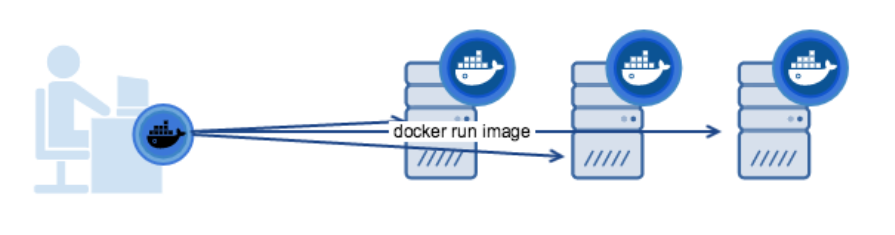
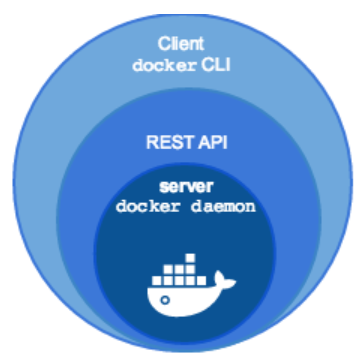
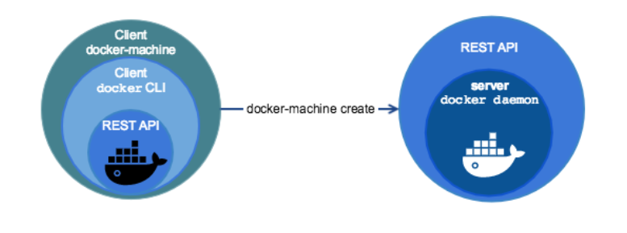
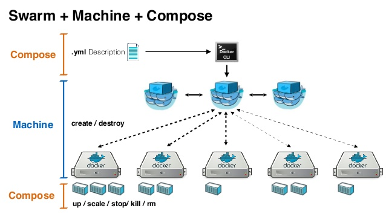
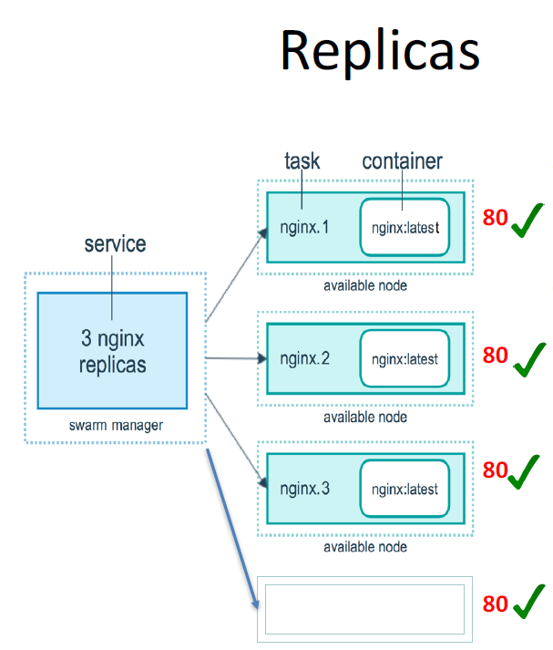

### Running Docker in Production

### Pros and Cons of running Docker in Production:

  - One one hand, many docker pioneers are confident that a
distributed web app can be deployed at scale using Docker and
have incorporated Docker into their production environment.
  - On the other hand, there are still some people who are
reluctant to use Docker in production as they think docker
workflow is too complex or unstable for real life use cases.

### Concerns

  - There are still some missing pieces about Docker around data
persistence, networking, security and identity management.
  - The ecosystem of supporting Dockerized applications in
production such as tools for monitoring and logging are still
not fully ready yet.

### Companies that use Docker in production:


### Why Running Docker Containers inside VMs?
  - To address security concerns(separate the resource access to different customers `data`, `traffic`)
  - Hardware level isolation(want to ensure that hardware are available for all containers and there isn't any starvation situation)

### Worth nothing

  - Most popular content or management service such as Google container engine and like `Google Container enginer` or `Amazon EC2` still use VMs internally.

The simplest way to provision new VMS and containers on top of then is by using Docker Machine.
[Docker Machine](https://docs.docker.com/machine/overview/) is a tool that lets you install Docker Engine on virtual hosts, and manage the hosts with docker-machine commands.
You can use Machine to create Docker hosts on your local Mac or Windows box, on your company network, in your data center, or on cloud providers like Azure, AWS, or Digital Ocean.
Simply put docker machine can be used of orchestration
Docker Machine can provision new volume's install `dockertools` on them and link docker client with remote docker machines.
We can provision a VM on our local machine to do that. We need VirtualBox which is a virtualization technology that allows us to install multiple guest operating systems on a single machine.

Each docker host setup by docker machine is a combination of:
* docker host
* docker client

### Docker-machine 1


### Docker-machine 2


### Difference between Docker CE and Docker Machine

Docker-CE is a client-server application. The client interacts with the daemon using a REST API



Docker Machine is a tool for provisioning and managing your Dockerized hosts (hosts with Docker Engine on them). Typically, you install Docker Machine on your local system. Docker Machine has its own command line client docker-machine and the Docker Engine client, docker.
Using docker-machine you cand deploy host containing docker-ce on virtual hosts(i.e, AWS,DigitalOcean etc, or locally)



### Install Docker machine

Instructions for Docker Machine installation available [here](https://docs.docker.com/machine/install-machine/#install-machine-directly)

```
base=https://github.com/docker/machine/releases/download/v0.16.0 &&
>   curl -L $base/docker-machine-$(uname -s)-$(uname -m) >/tmp/docker-machine &&
> install /tmp/docker-machine /usr/local/bin/docker-machine
  % Total    % Received % Xferd  Average Speed   Time    Time     Time  Current
                                 Dload  Upload   Total   Spent    Left  Speed
100   617    0   617    0     0   1024      0 --:--:-- --:--:-- --:--:--  1024
100 26.8M  100 26.8M    0     0  1011k      0  0:00:27  0:00:27 --:--:--  857k
```

### Check Docker-machine version:

```
docker-machine -v
docker-machine version 0.16.0, build 702c267f
```

### Setup a production cloud account

We register a [DigitalOcean account](https://www.digitalocean.com/) so we can deploy our app. Digital Ocean is a cloud infrastructure provider that can easily provision virtual servers for you.It is similar to AWS EC2 and we can use it to deploy, manage, and scale cloud applications.

We use API's to manage, use the resources and provision VMs
In API section we generate an access token. We use the access token to create e new VM on DigitalOcean, installing docker, create certificates.

### Create docker-app-machine on digitalocean


```
docker-machine create --driver digitalocean --help
Usage: docker-machine create [OPTIONS] [arg...]

Create a machine

Description:
   Run 'docker-machine create --driver name --help' to include the create flags for that driver in the help text.

Options:

   --digitalocean-access-token 										Digital Ocean access token [$DIGITALOCEAN_ACCESS_TOKEN]
 ```

 ```
 docker-machine create --driver digitalocean --digitalocean-access-token `token_setup_previously` docker-app-machine

 Creating CA: /root/.docker/machine/certs/ca.pem
Creating client certificate: /root/.docker/machine/certs/cert.pem
Running pre-create checks...
Creating machine...
(docker-app-machine) Creating SSH key...
(docker-app-machine) Creating Digital Ocean droplet...
(docker-app-machine) Waiting for IP address to be assigned to the Droplet...
Waiting for machine to be running, this may take a few minutes...
Detecting operating system of created instance...
Waiting for SSH to be available...
Detecting the provisioner...
Provisioning with ubuntu(systemd)...
Installing Docker...
Copying certs to the local machine directory...
Copying certs to the remote machine...
Setting Docker configuration on the remote daemon...
Checking connection to Docker...
Docker is up and running!
To see how to connect your Docker Client to the Docker Engine running on this virtual machine, run: docker-machine env docker-app-machine
```

### Connection informations:

docker-machine env docker-app-machine
```
export DOCKER_TLS_VERIFY="1"
export DOCKER_HOST="tcp://ip_addr:port"
export DOCKER_CERT_PATH="/root/.docker/machine/machines/docker-app-machine"
export DOCKER_MACHINE_NAME="docker-app-machine"
# Run this command to configure your shell:
# eval $(docker-machine env docker-app-machine)
```


Run the environment variables which would configure our doctor client to connect to the VM which is provisioned

```eval $(docker-machine env docker-app-machine)
```

Display the system wide information about the new VM:

```
docker info
Containers: 0
 Running: 0
 Paused: 0
 Stopped: 0
Images: 0
------------------------------------------------------------------------------------------------------------
Operating System: Ubuntu 16.04.5 LTS
OSType: linux
Architecture: x86_64
CPUs: 1
Total Memory: 992.2MiB
Name: docker-app-machine
------------------------------------------------------------------------------------------------------------
Labels:
 provider=digitalocean
Experimental: false
```

Digital Ocean VM | Specs
-|-
OS | Ubuntu 16.04.5 LTS
Architecture | x86_64
CPU  | 1  
Memory  |  992.2 Mib

Finally we need to deploy our docker container. We use the app image that passed all the tests in `Circle CI` and pushed to `DockerHub`.
Instead of rebuilding the image using Dockerfile locally we make a copy of the compose file and edit it.
We remove the build section from prod.yml and put the latest image from our DockerHub account:

```
version: "3.0"
services:
  dockerapp:
    image: praslea/dockerapp
    ports:
      - "5000:5000"
    depends_on:
      - redis
  redis:
    image: redis:3.2.0
```


With `-f` switch we put our new docker-compose file then `-d` to started the containers in the background.
This would deploy all the services defined in compose file to the remote VM.

docker-compose -f prod.yml up -d
```
Creating network "dockerapp_default" with the default driver
Pulling redis (redis:3.2.0)...
3.2.0: Pulling from library/redis
------------------------------------------------------------------------------------------------------------
Pulling dockerapp (praslea/dockerapp:)...
latest: Pulling from praslea/dockerapp
------------------------------------------------------------------------------------------------------------
Creating dockerapp_redis_1_f58637094be9 ... done
Creating dockerapp_dockerapp_1_6ae529f9cf79 ... done
```

We verify that docker machine is up and running:

docker-machine ls
```
NAME                 ACTIVE   DRIVER         STATE     URL                        SWARM   DOCKER     ERRORS
docker-app-machine   *        digitalocean   Running   tcp://ip:port           v18.09.0   
```

`*` -- specifies that this docker-machine is active and all the changes we make will be done on this particular machine.

### Verify dockerapp in DigitalOcean:


There are several `digitalocean` drives we can use `--help` switch or [this link](https://docs.docker.com/machine/drivers/digital-ocean/)

docker-machine create --driver digitalocean --help
Usage: docker-machine create [OPTIONS] [arg...]

Create a machine

Description:
   Run 'docker-machine create --driver name --help' to include the create flags for that driver in the help text.

Options | Description
-|-
   --digitalocean-access-token | Digital Ocean access token [$DIGITALOCEAN_ACCESS_TOKEN]
   --digitalocean-backups | enable backups for droplet [$DIGITALOCEAN_BACKUPS]
   --digitalocean-image "ubuntu-16-04-x64" | Digital Ocean Image [$DIGITALOCEAN_IMAGE]
   --digitalocean-ipv6 | enable ipv6 for droplet [$DIGITALOCEAN_IPV6]
   --digitalocean-monitoring | enable monitoring for droplet [$DIGITALOCEAN_MONITORING]
   --digitalocean-private-networking | enable private networking for droplet [$DIGITALOCEAN_PRIVATE_NETWORKING]
   --digitalocean-region "nyc3" | Digital Ocean region [$DIGITALOCEAN_REGION]
   --digitalocean-size "s-1vcpu-1gb" | Digital Ocean size [$DIGITALOCEAN_SIZE]
   --digitalocean-ssh-key-fingerprint | SSH key fingerprint [$DIGITALOCEAN_SSH_KEY_FINGERPRINT]
   --digitalocean-ssh-key-path | SSH private key path  [$DIGITALOCEAN_SSH_KEY_PATH]
   --digitalocean-ssh-port "22"	| SSH port [$DIGITALOCEAN_SSH_PORT]
   --digitalocean-ssh-user "root"	| SSH username [$DIGITALOCEAN_SSH_USER]
   --digitalocean-tags | comma-separated list of tags to apply to the Droplet [$DIGITALOCEAN_TAGS]
   --digitalocean-userdata | path to file with cloud-init user-data [$DIGITALOCEAN_USERDATA]
   --driver, -d "virtualbox" | Driver to create machine with. [$MACHINE_DRIVER]
   --engine-env [--engine-env option --engine-env option]	| Specify environment variables to set in the engine
   --engine-insecure-registry [--engine-insecure-registry option --engine-insecure-registry option] | 	Specify insecure registries to allow with the created engine
   --engine-install-url "https://get.docker.com" | Custom URL to use for engine installation [$MACHINE_DOCKER_INSTALL_URL]
   --engine-label [--engine-label option --engine-label option]	| Specify labels for the created engine
   --engine-opt [--engine-opt option --engine-opt option]	| Specify arbitrary flags to include with the created engine in the form flag=value
   --engine-registry-mirror [--engine-registry-mirror option --engine-registry-mirror option] | Specify registry mirrors to use [$ENGINE_REGISTRY_MIRROR]
   --engine-storage-driver | Specify a storage driver to use with the engine
   --swarm | Configure Machine to join a Swarm cluster
   --swarm-addr | addr to advertise for Swarm (default: detect and use the machine IP)
   --swarm-discovery | Discovery service to use with Swarm
   --swarm-experimental | Enable Swarm experimental features
   --swarm-host "tcp://0.0.0.0:3376" | ip/socket to listen on for Swarm master
   --swarm-image "swarm:latest"	| Specify Docker image to use for Swarm [$MACHINE_SWARM_IMAGE]
   --swarm-join-opt [--swarm-join-opt option --swarm-join-opt option] | Define arbitrary flags for Swarm join
   --swarm-master	| Configure Machine to be a Swarm master
   --swarm-opt [--swarm-opt option --swarm-opt option] | Define arbitrary flags for Swarm master
   --swarm-strategy "spread" | Define a default scheduling strategy for Swarm
   --tls-san [--tls-san option --tls-san option] | Support extra SANs for TLS certs

### What is swarm

A swarm consists of multiple Docker hosts which run in swarm mode and act as managers (to manage membership and delegation) and workers (which run swarm services). A given Docker host can be a manager, a worker, or perform both roles.

### Nodes

A node is an instance of the Docker engine participating in the swarm. You can also think of this as a Docker node. You can run one or more nodes on a single physical computer or cloud server, but production swarm deployments typically include Docker nodes distributed across multiple physical and cloud machines.
To deploy your application to a swarm, you submit a service definition to a manager node. The manager node dispatches units of work called tasks to worker nodes.

### Worker nodes

Worker nodes receive and execute tasks dispatched from manager nodes. By default manager nodes also run services as worker nodes, but you can configure them to run manager tasks exclusively and be manager-only nodes.

### Services and tasks

A service is the definition of the tasks to execute on the manager or worker nodes. It is the central structure of the swarm system and the primary root of user interaction with the swarm.

When you create a service, you specify which container image to use and which commands to execute inside running containers.

### Scale Docker for large applications

A swarm is a group of machines that are running Docker and joined into a cluster. After that has happened, you continue to run the Docker commands you’re used to, but now they are executed on a cluster by a swarm manager. The machines in a swarm can be physical or virtual. After joining a swarm, they are referred to as nodes.
This is what Docker Swarm is for:

  - Docker Swarm is a tool that clusters many Docker Engines and schedules Containers
  - Docker Swarm decides on which host to run the container based on scheduling methods

Docker Swarm manages remote hosts in the cloud running docker daemon. Swarm manager knows the status of each Docker Node in the cluster.Swarm can grow multiple hosts into a cluster and distribute dcoker containers among these hosts. So the work load is divided by the nodes in the swarm and this is transparent to the end users.
The workload is outsourced from the client to swarm manager.
Swarm managers are the only machines in a swarm that can execute your commands, or authorize other machines to join the swarm as workers. Workers are just there to provide capacity and do not have the authority to tell any other machine what it can and cannot do.

### How Swarm cluster works
  - To deploy your application to a swarm, you submit your service to a
manager node.
  - The manager node dispatches units of work called tasks to worker nodes.
  - Manager nodes also perform the orchestration and cluster management
functions required to maintain the desired state of the swarm.
  - Worker nodes receive and execute tasks dispatched from manager nodes.
  - An agent runs on each worker node and reports on the tasks assigned to
it. The worker node notifies the manager node of the current state of its
assigned tasks so that the manager can maintain the desired state of each
worker.


### Setup 2 nodes in swarm cluster:

  - Step 1: Deploy two VMs, one will be used for the Swam manager node,
and the other one will be used as a worker node.
  - Step 2: Appoint the first VM as Swarm manager node and initialize a
Swarm cluster.
– docker swarm init
  - Step 3: Let the second VM join the Swarm cluster as a worker node.
– docker swarm join


### Create DigitalOcean swarm-manager using docker-machine:


docker-machine create --driver digitalocean --digitalocean-access-token `access_token_api` swarm-manager
```
Running pre-create checks...
Creating machine...
(swarm-manager) Creating SSH key...
(swarm-manager) Creating Digital Ocean droplet...
(swarm-manager) Waiting for IP address to be assigned to the Droplet...
Waiting for machine to be running, this may take a few minutes...
Detecting operating system of created instance...
Waiting for SSH to be available...
Detecting the provisioner...
Provisioning with ubuntu(systemd)...
Installing Docker...
Copying certs to the local machine directory...
Copying certs to the remote machine...
Setting Docker configuration on the remote daemon...
Checking connection to Docker...
Docker is up and running!
To see how to connect your Docker Client to the Docker Engine running on this virtual machine, run: docker-machine env swarm-manager
```

### Connect docker-client to swarm-manager:

docker-machine env swarm-manager
```
export DOCKER_TLS_VERIFY="1"
export DOCKER_HOST="tcp://ip:port"
export DOCKER_CERT_PATH="/root/.docker/machine/machines/swarm-manager"
export DOCKER_MACHINE_NAME="swarm-manager"
# Run this command to configure your shell:
# eval $(docker-machine env swarm-manager)
```

### Setup swarm-manager shell:

```
eval $(docker-machine env swarm-manager)
```

### Setup Docker Worker node:

docker-machine create --driver digitalocean --digitalocean-access-token `access-access_token_api` swarm-node
```
Running pre-create checks...
Creating machine...
(swarm-node) Creating SSH key...
(swarm-node) Creating Digital Ocean droplet...
(swarm-node) Waiting for IP address to be assigned to the Droplet...
Waiting for machine to be running, this may take a few minutes...
Detecting operating system of created instance...
Waiting for SSH to be available...
Detecting the provisioner...
Provisioning with ubuntu(systemd)...
Installing Docker...
Copying certs to the local machine directory...
Copying certs to the remote machine...
Setting Docker configuration on the remote daemon...
Checking connection to Docker...
Docker is up and running!
To see how to connect your Docker Client to the Docker Engine running on this virtual machine, run: docker-machine env swarm-node
```

### Appoint the first VM as a swarm-manager.

This is done by a `docker swarm init` command. Docker engine targeted by this command becomes a manager in the newly created a single note swarm. But we need to verify which docker-machine is active. The command will apply to the active one. This is singled out by the `*` sign.

List docker-machines:

docker-machine ls
```
NAME                 ACTIVE   DRIVER         STATE     URL                          SWARM   DOCKER     ERRORS
docker-app-machine   -        digitalocean   Running   tcp://ip1:port             v18.09.0   
swarm-manager        *        digitalocean   Running   tcp://ip2:port             v18.09.0   
swarm-node           -        digitalocean   Running   tcp://ip3:port             v18.09.0   
```

### docker swarm init fails:

This is because we did not specify which address to use. This is a feature of `DigitalOcean` which allows private networking between hosts in the same data center. The public IP can be accessed from anywhere else but the private IP can only be accessed by hosts in.

docker swarm init
```
Error response from daemon: could not choose an IP address to advertise since this system has multiple addresses on interface eth0 (ip_public and ip_private) - specify one with --advertise-addr
```

### Initialize docker swarm with public ip:

docker swarm init --advertise-addr `ip_public`
```
Swarm initialized: current node (ap09d0vvpe2z9422gwvmlezq0) is now a manager.

To add a worker to this swarm, run the following command:

    docker swarm join --token `SWMTKN-1-1zr55y ip_public:port`

To add a manager to this swarm, run 'docker swarm join-token manager' and follow the instructions.
```

Using `docker swarm join` we can bring a docker node into a swarm cluster. But we need to be inside the node to do this. Fist we need to ssh, the add the node to the cluster

docker-machine ssh swarm-node
```
Welcome to Ubuntu 16.04.5 LTS (GNU/Linux 4.4.0-140-generic x86_64)

 * Documentation:  https://help.ubuntu.com
 * Management:     https://landscape.canonical.com
 * Support:        https://ubuntu.com/advantage

  Get cloud support with Ubuntu Advantage Cloud Guest:
    http://www.ubuntu.com/business/services/cloud

16 packages can be updated.
7 updates are security updates.

New release '18.04.1 LTS' available.
Run 'do-release-upgrade' to upgrade to it.
```

### Join swarm cluster:

```
docker swarm join --token `SWMTKN-1-1zr55y public:port`
This node joined a swarm as a worker.
```
### Docker swarm commands

Commands | Description
-|-
docker swarm init | Initialize a swarm. The docker engine targeted by this command
becomes a manager in the newly created single-node swarm.
docker swarm join | Join a swarm as a Swarm node.
docker swarm leave | Leave the swarm


### Deploy serviced to Swarm cluster


### Docker Services

  - The services can be defined in our Docker compose file.
  - The service definition includes which Docker images to run, the port
mapping and dependency between services.
Docker Services
  - When we are deploying services in the swarm mode, we can also set another important configuration, which is the deploy key and it is only available on Compose file formats version 3.x and up.
  - The deploy key and its sub-options can be used to load balance and optimize performance for each service.

In version three we can deploy multiple replicas and we use these replicas to load balance and optimize service performance. This also provides `High-Availability`and in the event a node goes down the other nodes can load-balance.
Docker publishes a port for a service. It does so by listening on that port across all nodes within that swarm cluster when traffic arrives on that port. That traffic is then routed to a container running for that service.


### Swarm+Machine+Compose



### Ingress load balancing:

We can connect to the nginx service through a node which does NOT have nginx replicas, this is called ingress load balancing:

  - All nodes listen for connections to published service ports.
  - When that service is called by external systems, the receiving node will accept the traffic and internally load balance it using an internal DNS service that Docker maintains.




Besides this we can specify the percentage of CPU to use per node, `RAM` and `restart_policy`.

### Docker Stack

  - A docker stack is a group of interrelated services that share dependencies, and can be orchestrated an scaled together.
  - You can image that a stack is a live collection of all the services defined in your docker compose file.
  - Create a stack from your docker compose file:
      - docker stack deploy
  - In the Swarm mode,
      - Docker compose files can be used for service definitions.
      - Docker compose commands can’t be reused. Docker compose commands can only schedule the containers to a single node. We can't user docker-compose up, down docker-compose etc.
      - We have to use docker stack command. You can think of docker stack as the docker compose in the swarm mode.

### Deploy dockerapp

1. Open the prod.yml file and deploy a key for our service. We define 2 replicas:

cat prod.yml
```
version: "3.0"
services:
  dockerapp:
    image: praslea/dockerapp
    ports:
      - "5000:5000"
    depends_on:
      - redis
    deploy:
      replicas: 2
  redis:
    image: redis:3.2.0
```

2. Create a stack from docker-compose file

docker stack deploy --compose-file prod.yml dockerapp_stack
```
Creating network dockerapp_stack_default
Creating service dockerapp_stack_dockerapp
Creating service dockerapp_stack_redis
```

Docker stack has created an overlay network docker_stack_default for communication across the nodes.

### List all the services on swarm:
We can list all the stacks on the swarm cluster by running `docker stack ls`.
Right now we only have a single stack composed of two services. we list out all the services in the stack

docker stack ls
```
NAME                SERVICES            ORCHESTRATOR
dockerapp_stack     2                   Swarm
```

### List docker stack services:

We list out all the services in the stack by running docker stack services and provide the stack name as you see. We have two services running the `redis service` has one replica and the `dockerapp service` has two replicas.
docker stack services dockerapp_stack

```
ID                  NAME                        MODE                REPLICAS            IMAGE                      PORTS
aauncstdynhx        dockerapp_stack_dockerapp   replicated          2/2                 praslea/dockerapp:latest   *:5000->5000/tcp
qnrf0oof832g        dockerapp_stack_redis       replicated          1/1                 redis:3.2.0                
```

### List ips for Docker VMs:

docker-machine ls
```
NAME                 ACTIVE   DRIVER         STATE     URL                          SWARM   DOCKER     ERRORS
docker-app-machine   -        digitalocean   Running   tcp://ip1:port             v18.09.0   
swarm-manager        *        digitalocean   Running   tcp://ip2:port              v18.09.0   
swarm-node           -        digitalocean   Running   tcp://ip3:port           v18.09.0
```  
### Update production services

We can update the production services by editing the config file and running docker-compose. Changing the listening port from 5000-->4000.

```
version: "3.0"
services:
  dockerapp:
    image: praslea/dockerapp
    ports:
      - "4000:5000"
    depends_on:
      - redis
    deploy:
      replicas: 2
  redis:
    image: redis:3.2.0
```

The stack deploy command tells us it's updating the service as opposed from the first time when we created the service:

docker stack deploy --compose-file prod.yml dockerapp_stack
```
Updating service dockerapp_stack_dockerapp (id: aauncstdynhxnnl72hrprodvt)
Updating service dockerapp_stack_redis (id: qnrf0oof832gcp58rqaezdkjz)
```

### Check stack ports

docker stack services dockerapp_stack

```
ID                  NAME                        MODE                REPLICAS            IMAGE                      PORTS
aauncstdynhx        dockerapp_stack_dockerapp   replicated          2/2                 praslea/dockerapp:latest   *:4000->5000/tcp
qnrf0oof832g        dockerapp_stack_redis       replicated          1/1                 
redis:3.2.0
```
### Check HTTP access port change:


### Setup 2 redis replicas:

```
version: "3.0"
services:
  dockerapp:
    image: praslea/dockerapp
    ports:
      - "4000:5000"
    depends_on:
      - redis
    deploy:
      replicas: 2
  redis:
    image: redis:3.2.0
    deploy:
       replicas: 2
```

docker stack deploy --compose-file prod.yml dockerapp_stack
```
Updating service dockerapp_stack_dockerapp (id: aauncstdynhxnnl72hrprodvt)
Updating service dockerapp_stack_redis (id: qnrf0oof832gcp58rqaezdkjz)
```         

### Check redis replicas:

docker stack  services dockerapp_stack
```
ID                  NAME                        MODE                REPLICAS            IMAGE                      PORTS
aauncstdynhx        dockerapp_stack_dockerapp   replicated          2/2                 praslea/dockerapp:latest   *:4000->5000/tcp
qnrf0oof832g        dockerapp_stack_redis       replicated          2/2                 redis:3.2.0   
```


### Docker stack commands:

|Command | Description| 
|--- | ---|
|docker stack deploy | Deploy a new stack or update an existing stack|
|docker stack ls | List stacks|
|docker stack ps | List the tasks in the stack|
|docker stack rm | Remove one or more stacks|
|docker stack services | List the services in the stack|
